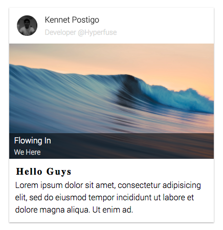

<p align="center">
  
</p>
<h1 align="center">Rad Card</h1>

A simple card component that is small and easily extendable.


The rad-card module exposes 3 components:
```js
import { Card, CardHeader, CardMedia } from 'rad-card';
```
### `<Card />` Props

#### `className?: string`
A css class you want to place on the component. If not passed it will
default to `card`.

#### `width?: string | number`
The width you would like the card to be set to. Defaults to 300.

#### `height?: string | number`
The height you would like the card to be set to. Defaults to 400.

#### `shadow?: string`
The shadow you want the card to have. If you don't want a shadow to be placed
on the Card component pass `shadow='none'` to the component.

#### `backgroundColor?: string`
The backgroundColor you want the Card component to be. Defaults to white.

#### `styles? Object`
If you want to customize further pass a styles object component and the
component will combine and prioritize your styles.

### `<CardHeader />` Props

#### `className: string`
A css class you want to place on the component. If not passed it will
default to `cardHeader`.

#### `height?: string | number`
The height you want the CardHeader to be within the Card.

#### `avatar?: string`
A link or path to an image that will be nicely rendered in the CardHeader.

#### `avatarHeight?: number`
The height the avatar should be within the CardHeader.

#### `avatarWidth?: number`
The width the avatar should be within the CardHeader.

#### `title?: string`
A title that will be rendered within the CardHeader.

#### `titleSize?: number`
The font-size of the title.

#### `subtitle?: string`
A subtitle that will be rendered within the CardHeader.

#### `subtitleSize?: number`
The font-size of the subtitle.

#### `styles?: {cardHeader?, avatar?, title?, subtitle?}`
The cardHeader, avatar, title, subtitle fields within styles are objects as
well. The nested objects target specific elements css as their names should describe
to you. Pass a styles object with the nested objects component and the
component will combine and prioritize your styles.

<p align="center">
  
</p>

### `<CardMedia />` Props

#### `className: string`
A css class you want to place on the component. If not passed it will
default to `cardMedia`.

#### `height?: string | number`
The width you want the CardMedia component to be within the Card Component.

#### `img?: string`
A link or path to an image that will render within CardMedia.

#### `backgroundColor?: string`
background color of CardMedia.

#### `overlay?: { title: string, subtitle: string }`
An overlay that is placed on top the image in CardMedia.

#### `overlayHeight?: number`
The height the overlay should take up on the image.

#### `overlyTitleSize?: number`
The font size of the title on the overlay.

#### `overlayTitleColor?: string`
The title color.

#### `overlaySubtitleSize?: number`
The font size of the subtitle on the overlay.

#### `overlaySubtitleColor?: string`
The subtitle color.

#### `styles?: {media?, overlay?, title?, subtitle?}`
The media, overlay, title, subtitle fields within styles are objects as
well. The nested objects target specific elements css as their names should describe
to you. Pass a styles object with the nested objects component and the
component will combine and prioritize your styles.

<p align="center">
  
</p>

### Sample Usage of Card:
```js
import { Card, CardHeader, CardMedia } from 'rad-card';

function CardExample(props) {
  return (
    <Card>
      <CardHeader
        avatar="https://avatars2.githubusercontent.com/u/8888991?v=3&amp;s=400"
        title="Kennet Postigo"
        subtitle="Developer @Hyperfuse"
      />
      <CardMedia
        media="https://9to5mac.files.wordpress.com/2013/09/rolling-waves.jpg"
        overlay={{ title: 'Flowing In', subtitle: 'We Here' }}
      />
      <div style={{ margin: 10 }}>
        <h3 style={{ margin: 4 }}>Hello Guys</h3>
        <p style={{ margin: 2 }}>
          Lorem ipsum dolor sit amet, consectetur adipisicing elit,
          sed do eiusmod tempor incididunt ut labore et dolore magna
          aliqua. Ut enim ad.
        </p>
      </div>
    </Card>
  );
}
```
outputs:
<p align="center">
  
</p>
