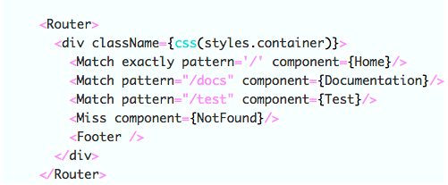

<p align="center">
  
</p>
<h1 align="center">Rad Codehighlighter</h1>

A simple Codehighlighter component that is small and easily extendable.


The rad-codehighlighter module exposes 1 component:
```js
import { Codehighlighter } from 'rad-codehighlighter';
```
### `<Codehighlighter />` Props

#### `className?: string`
A css class you want to place on the component. If not passed it will
default to `Codehighlighter`.

#### `language?: string`
The language you want to highlight.

#### `plugins?: Array<{title: string, func: Function }>`
prism plugins you might use to add line numbers, file names, etc.


### Sample Usage of Codehighlighter:
```js
function CodeHighlighterSelfContained(props) {
  return (
    <Codehighlighter language="javascript">
      {`
<Router>
  <div className={css(styles.container)}>
    <Match exactly pattern='/' component={Home}/>
    <Match pattern="/docs" component={Documentation}/>
    <Match pattern="/test" component={Test}/>
    <Miss component={NotFound}/>
    <Footer />
  </div>
</Router>
`}
    </Codehighlighter>
  );
}
```


outputs:
<p align="center">
  
</p>
