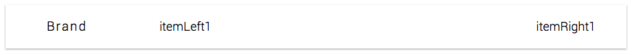
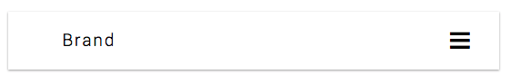
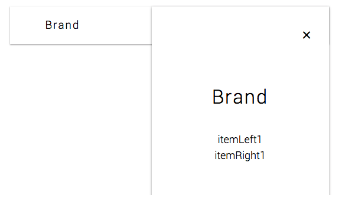

<p align="center">
  
</p>
<h1 align="center">Rad Navbar</h1>

A simple Navbar component that is small and easily extendable.


The rad-navdrawer module exposes 4 component:
```js
import { Navbar, Navbrand, NavItemsLeft, NavItemsRight } from 'rad-navbar';
```

### `<Navbar />` Props

#### `className?: string`
A css class you want to place on the component. If not passed it will
default to `navbar`.

#### `breakPoint?: number`
This prop tells the Navbar at which size the navbar should hide it's content
within the navdrawer and show the drawer menu icon.

#### `showMenu?: boolean`
When nav contents are hidden in the menu this prop determines whether to open
the menu or not.

#### `openMenu?: Function`
Function that when invoked opens the menu.

#### `closeMenu?: Function`
Function that when invoked closes the menu.

#### `height?: string | number`
Height of the navbar.

#### `shadow?: string`
Used to add a shadow to the navbar. To remove the default shadow pass `"none"`
as the prop.

#### `styles?: {navbar?, navbtn?, navdrawer?: { navMenu?, navMenuBtn?, navExitBtn? } }`
The navbar, navbtn, navdrawer fields within styles object are objects as
well. The nested objects target specific elements css as their names should
describe to you. Pass a styles object with the nested objects component and the
component will combine and prioritize your styles.


### `<Navbrand />` Props
#### `className?: string`
A css class you want to place on the component. If not passed it will
default to `navbrand`.

#### `styles?: Object`
Pass a styles object and the component will combine and prioritize your styles.


### `<NavItemsLeft />` & `<NavItemsRight />` Props
#### `className?: string`
A css class you want to place on the component. If not passed it will
default to `navitemsleft` or `navitemsright`.

#### `width: number`
The width you want the items to take on the navbar.

#### `styles?: { navItems?, navItemsSmall? }`
The navItems, navItemsSmall fields within styles object are objects as
well. The nested objects target specific elements css as their names should
describe to you. Pass a styles object with the nested objects component and the
component will combine and prioritize your styles.


### Sample Usage of Navbar:
```js
import { Navbar, Navbrand, NavItemsLeft, NavItemsRight } from 'rad-navbar';

function NavbarSelfContained(props) {
  return (
    <Navbar>
      <Navbrand>
        <h3>
          <Navbrand>
            <a to="/">Brand</a>
          </Navbrand>
        </h3>
      </Navbrand>
      <NavItemsLeft>
        <a>itemLeft1</a>
      </NavItemsLeft>
      <NavItemsRight>
        <a>itemRight1</a>
      </NavItemsRight>
    </Navbar>
  );
}
```
Outputs:
<p style="display: flex; justify-content: space-around; align-items: center" align="center">
  <span>
    
  </span>
  <span>
</p>
<h3 style="margin-bottom: 35px; margin-top: 3px;" align="center">Navbar</h3>


<p style="display: flex; justify-content: space-around; align-items: center" align="center">
  <span>
    
  </span>
</p>
<h3 style="margin-bottom: 35px; margin-top: 3px;" align="center">Navbar After Breakpoint</h3>


<p style="display: flex; justify-content: space-around; align-items: center" align="center">
  <span>
    
  </span>
</p>
<h3 style="margin-bottom: 35px; margin-top: 3px;" align="center">Navbar Open</h3>
