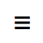
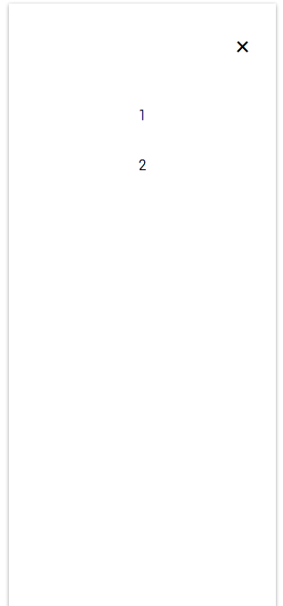

<p align="center">
  
</p>
<h1 align="center">Rad Navdrawer</h1>

A simple Navdrawer component that is small and easily extendable.


The rad-navdrawer module exposes 1 component:
```js
import { Navdrawer } from 'rad-navdrawer';
```
### `<Navdrawer />` Props

#### `className?: string`
A css class you want to place on the component. If not passed it will
default to `navdrawer`.

#### `showMenu?: boolean`
Boolean passed in that determines if the menu is visible.

#### `openMenu?: Function`
Function that when called opens the menu.

#### `closeMenu?: Function`
Function that when called closes the menu.

#### `menuIcon?: any`
Menu Icon for the navdrawer

#### `closeIcon?: any`
Close icon that you want to appear.

#### `placement: 'right' | 'left'`
Determines whether to appear on the left or right of the page.

#### `styles?: { navMenu?, navMenuBtn?, navExitBtn? }`
The navMenu, navMenuBtn, navExitBtn fields within styles object are objects as
well. The nested objects target specific elements css as their names should
describe to you. Pass a styles object with the nested objects component and the
component will combine and prioritize your styles.


### Sample Usage of Navdrawer:
```js
function NavdrawerExample (props) {
  return (
    <Navdrawer placement="right">
      <p>1</p>
      <p>2</p>
    </Navdrawer>
  );
}
```
Outputs:
<p style="display: flex; justify-content: space-around; align-items: center" align="center">
  <span>
    
    <span style="display: block; margin-top: 10px">closed</span>
  </span>
  <span>
    
    <span style="display: block; margin-top: 10px">open</span>
  </span>
</p>
