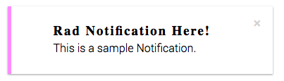

<p align="center">
  
</p>
<h1 align="center">Rad Notification</h1>

A simple Notification component that is small and easily extendable.


The rad-notification module exposes 1 component:
```js
import { Notification } from 'rad-notification';
```
### `<Notification />` Props

#### `className?: string`
A css class you want to place on the component. If not passed it will
default to `notification`.

#### `width?: string | number`
The width you want the notification to have.

#### `height?: string | number`
The height you want the notification to have.

#### `showNotification: boolean`
Determines whether the notification is hidden or visible.

#### `dismiss: Function`
When invoked this function dismisses the notification.

#### `notiPlacement?: 'topLeft' | 'topRight' | 'bottomLeft' | 'bottomRight'`
Determines what area to show the notification in the browser.

#### `borderHighlight: string`
Highlight of the notification.

#### `backgroundColor?: string`
The background color you want the notification to have.

#### `styles?: {notification?, dismiss?, centerContainer?, notificationDismissed? }`
The notification, dismiss, centerContainer, notificationDismissed fields within styles
object are objects as well. The nested objects target specific elements css as
their names should describe to you. Pass a styles object with the nested objects
component and the component will combine and prioritize your styles.

### Sample Usage of Notification:
```js
class NotificationExample extends Component {
  constructor (props) {
    super(props);
    this.state = {
      showNotification: false
    }
  }

  showNotification () {
    this.setState((prevState) => ({showNotification: true}));
  }

  dismiss () {
    alert('do something when you dismiss a <Notification />')
    this.setState((prevState) => ({showNotification: false}));
  }

  render () {
    return (
      <div>
        <button onClick={() => this.showNotification()}>click me to trigger a {'<Notification />'}</button>
        <Notification showNotification={this.state.showNotification}
                      dismiss={() => this.dismiss()}
                      notiPlacement="bottomLeft"
                      borderHighlight="#FF9EF8">
          <div>
            <h3 style={{margin: 2}}>Rad Notification Here!</h3>
            <p style={{margin: 2}}>This is a sample Notification.</p>
          </div>
        </Notification>
      </div>
    );
  }
}
```
Outputs:
<p style="display: flex; justify-content: space-around; align-items: center" align="center">
  <span>
    
  </span>
</p>
