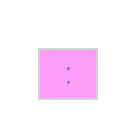
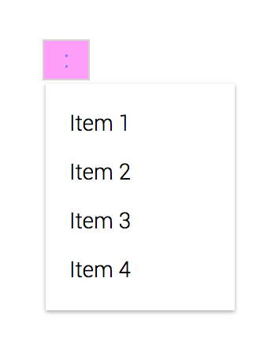

<p align="center">
  
</p>
<h1 align="center">Rad Popover</h1>

A simple Popover component that is small and easily extendable.


The rad-popover module exposes 1 component:
```js
import { Popover } from 'rad-popover';
```
### `<Popover />` Props

#### `className?: string`
A css class you want to place on the component. If not passed it will
default to `popover`.

#### `isOpen?: boolean`
Prop that determines whether the popover is visible.

#### `openPopover: Function`
Function that opens the popover.

#### `closePopover: Function`
Function that closes the popover.

#### `popoverWidth?: string | number`
Sets the width of the popover.

#### `popoverWidth?: string | number`
Sets the height of the popover

#### `popeeHeight?: string | number`
Sets the height of the popee(the element that you click to open the popover).

#### `popeeWidth?: string | number`
Sets the width of the popee(the element that you click to open the popover).

#### `menu: Function | any`
The react component that you want to attach the clickhandler on in order to
trigger the popover.

#### `styles?: { popee?, popover?, popoverClosed?, popoverItem? }` notificationDismissed? }`
The notification, dismiss, centerContainer, notificationDismissed fields within styles
object are objects as well. The nested objects target specific elements css as
their names should describe to you. Pass a styles object with the nested objects
component and the component will combine and prioritize your styles.

### Sample Usage of Notification:
```js
import { Popover } from 'rad-popover';

const Menu = (props) => <div style={{border: '1px solid lightgrey', textAlign: 'center', color: '#8574FF', backgroundColor: '#FF9EF8'}}><p style={{margin: 0,}}>:</p></div>;

export function PopoverSelfContained (props) {
  return (
    <Popover Menu={Menu}>
      <p style={{margin: 0}}>Item 1</p>
      <p style={{margin: 0}}>Item 2</p>
      <p style={{margin: 0}}>Item 3</p>
      <p style={{margin: 0}}>Item 4</p>
    </Popover>
  );
}
```
Outputs:
<p style="display: flex; justify-content: space-around; align-items: center" align="center">
  <span>
    
  </span>
</p>
<h3 align="center">Closed</h3>


<p style="display: flex; justify-content: space-around; align-items: center" align="center">
  <span>
    
  </span>
</p>
<h3 align="center">Open</h3>
