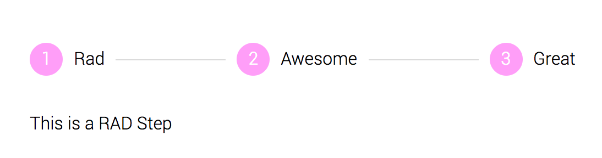
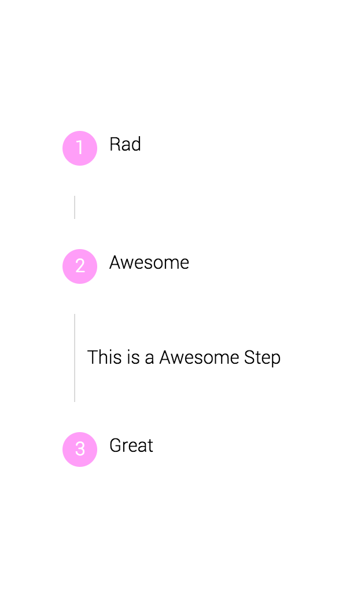

<p align="center">
  
</p>
<h1 align="center">Rad Stepper</h1>

A simple Stepper component that is small and easily extendable.


The rad-stepper module exposes 2 component:
```js
import { Stepper, Step } from 'rad-stepper';
```
### `<Stepper />` Props

#### `className?: string`
A css class you want to place on the component. If not passed it will
default to `stepper`.

#### `breakPoint?: number`
Prop that when the browser size hits a certain point the stepper will collapse vertically.

#### `showStep?: Function`
Function that will take a integer that represents a "step". The integer that is passed is the step taht will be
shown.

#### `activeStep?: number`
The current step being shown.

#### `seperatorSize?: string | number`
The size of the separators between steps.

#### `stepIndexColor?: string`
The color of the step.

#### `styles?: {hStepList?, vStepList?, hStepItem?, vStepItem?, hstepLead?, stepIndex?, vStepLead?, vStepLast?}`
The hStepList, vStepList, hStepItem, vStepItem, etc. are fields within styles
object are objects as well. The nested objects target specific elements css as
their names should describe to you. Pass a styles object with the nested objects
component and the component will combine and prioritize your styles.

### `<Step />` Props
#### `className?: string`
A css class you want to place on the component. If not passed it will
default to `step`.

### Sample Usage of Stepper:
```js
import { Stepper, Step } from 'rad-stepper';

function StepperSelfContained (props) {
  return (
    <Stepper breakPoint={750} seperatorSize={100}>
      <Step label="Rad">
        <p>This is a RAD Step</p>
      </Step>
      <Step label="Awesome">
        <p>This is a Awesome Step</p>
      </Step>
      <Step label="Great">
        <p>This is a Great Step</p>
      </Step>
    </Stepper>
  );
}

```
Outputs:
<p style="display: flex; justify-content: space-around; align-items: center" align="center">
  <span>
    
  </span>
</p>
<h3 align="center">Horizontal</h3>


<p style="display: flex; justify-content: space-around; align-items: center" align="center">
  <span>
    
  </span>
</p>
<h3 align="center">Vertical</h3>
