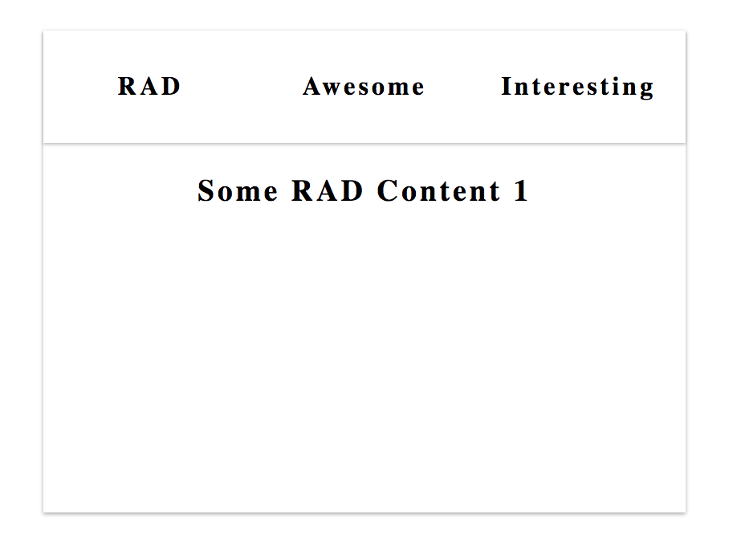

<p align="center">
  
</p>
<h1 align="center">Rad Tabs</h1>

A simple Tabs component that is small and easily extendable.


The rad-tabs module exposes 2 component:
```js
import { Tabs, Tab } from 'rad-tabs';
```
### `<Tabs />` Props

#### `className?: string`
A css class you want to place on the component. If not passed it will
default to `stepper`.

### `width?: string | number`
The width you want the component to have.

### `height?: string | number`
The height you want the component to have.

### `backgroundColor?: string`
The background color you want the component to have.

### `shadow?: string`
The shadow you want the component to have.

### `tabColor?: string`
The individual tab color.

### `tabHeight?: number`
The nested tabs row height.

### `activeTab?: number`
The current tab that is visible to the user.

### `showTab?: Function`
Function that takes an integer as a parameter that will be set as the activeTab.

### `styles?: { tabs?: Object, tabsList?: Object, tabItem?: Object }`
The hStepList, vStepList, hStepItem, vStepItem, etc. are fields within styles
object are objects as well. The nested objects target specific elements css as
their names should describe to you. Pass a styles object with the nested objects
component and the component will combine and prioritize your styles.

### `<Tab />` Props
#### `className?: string`
A css class you want to place on the component. If not passed it will
default to `step`.

### `label: string`
The label/name that will appear on the Tab.

### Sample Usage of Stepper:
```js
import { Tabs, Tab } from 'rad-tabs';

function TabsSelfContained (props) {
  return (
    <Tabs>
      <Tab label="RAD">
        <div style={{display: 'flex', alignItems: 'center', justifyContent: 'center'}}>
          <h3>Some RAD Content 1 </h3>
        </div>
      </Tab>
      <Tab label="Awesome">
        <div style={{display: 'flex', alignItems: 'center', justifyContent: 'center'}}>
          <h3>Some Awesome Content 2 </h3>
        </div>
      </Tab>

      <Tab label="Interesting">
        <div style={{display: 'flex', alignItems: 'center', justifyContent: 'center'}}>
          <h3>Some Interesting Content 3 </h3>
        </div>
      </Tab>
    </Tabs>
  );
}
```
Outputs:
<p style="display: flex; justify-content: space-around; align-items: center" align="center">
  <span>
    
  </span>
</p>
